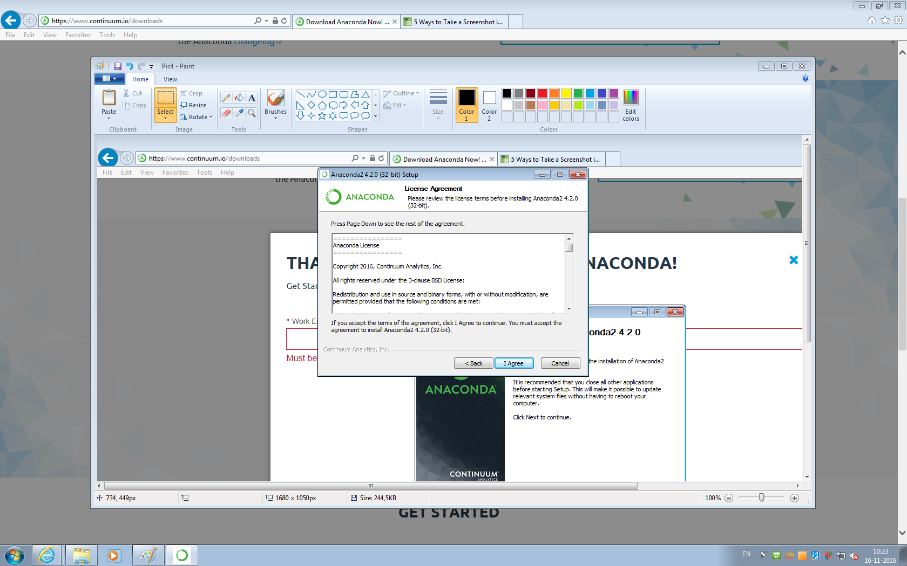
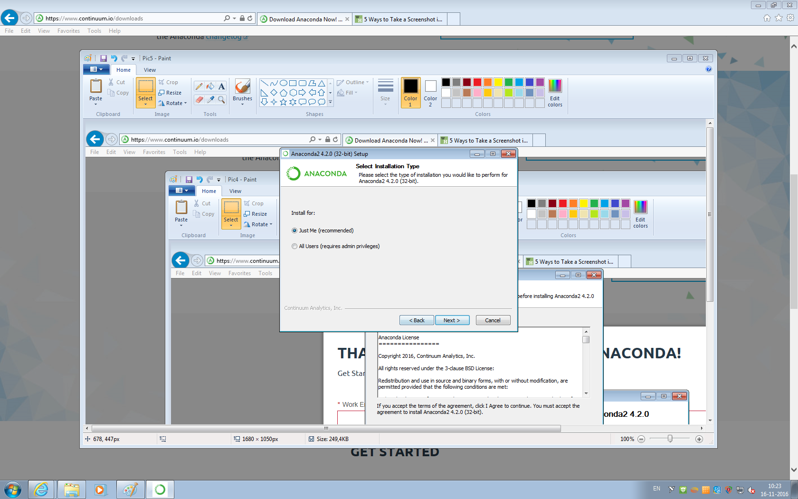
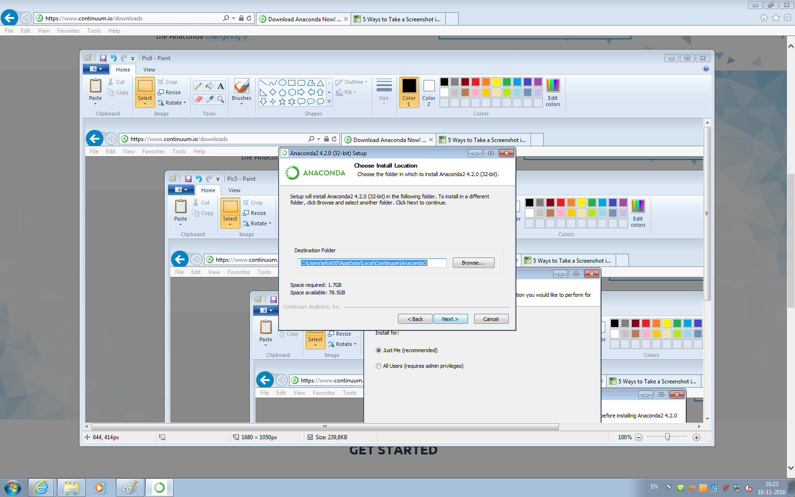
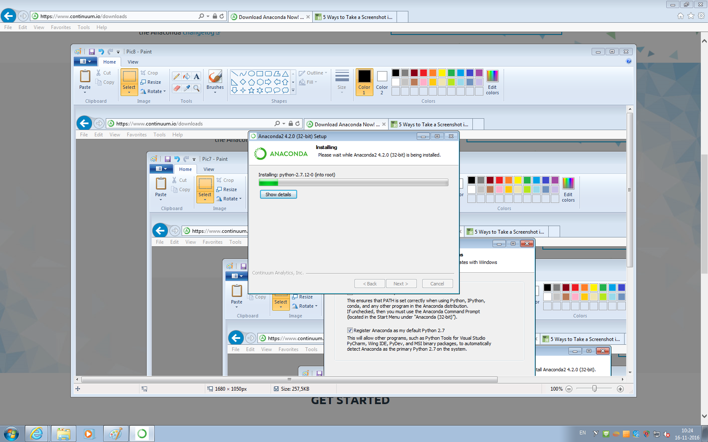
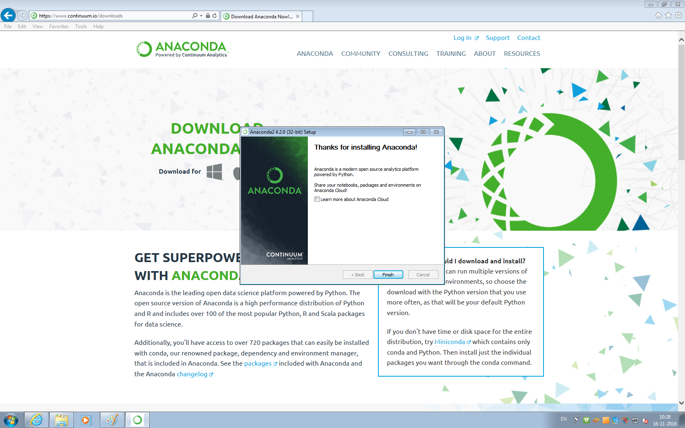
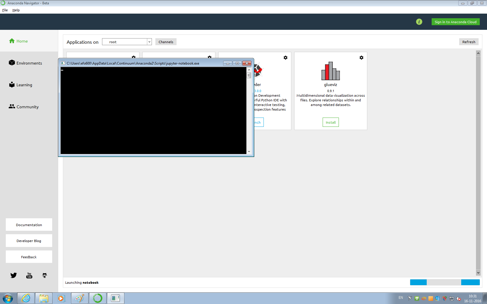

## Practical Assignment 6: Web Media Data Collection and Social Networks Analysis
##### Behavior Dynamics in Social Networks 2017

**PS.:** Do you use Github? You can get this assignment from [the repository](https://github.com/ericinlinux/BDiSN_Assignment_06).

Now we are going to move to social networks and web media. The first part of this assignment intends to give you a little taste of how to scrape data from Twitter, and how to evaluate results of the results. The second part is dedicated to social network analysis in a real data set. So you are going to work through a code that proccess a data set and converts it to a Gephi representation.

All of the code here is done in [Python](https://www.python.org/).  If you feel that you want to go deep in the language and learn more, I strongly suggest the course of [Dr. Chuck](https://www.pythonlearn.com/). It is a course for complete begginners. If you are familiar with programming and want to make a quicker transition to Python, you can find good material [here](https://www.learnpython.org/).

We also will use [Jupyter notebooks](http://jupyter.org/). A very accurate description of it, taken from their website: The Jupyter Notebook is an open-source web application that allows you to create and share documents that contain live code, equations, visualizations and narrative text. Uses include: data cleaning and transformation, numerical simulation, statistical modeling, data visualization, machine learning, and much more.

### Part A: Gathering data from social web media
This part of the assignment should be done using the Jupyter interface, through Anaconda development software. This software will allow you to use Python codes in a web interface, helping you to visualize your results and replicate others' easily.

**Step 1:** Download the Anaconda from their [website](https://www.anaconda.com/download). It is expected to provide the download that suits the platform of your PC.

The next screens are for Windows platform (from the lab where you are seated).

**Step 2:** after download, click at the Run button on the bottom of your web brower.

**Step 3:** Next-Next-Next

**Step 4:** if everything went fine, click Finish and unckeck the box (unless you are interested on learning more about Anaconda Cloud).

**Step 5:** open the **Anaconda Navigator** software.

**Step 6:** The Anaconda interface might look like the figure below. Here you have the notebook platform, and you can launch it from there.

**Step 7:** after a terminal (or console) shows some stuff happening (don't close it!), your web browser may show the following screen, with your files explorer.

Good! You are ready to start. You can create a new Notebook, but we are going to use a defined notebook. So go to Canvas and download the file Assingment_06.zip to your computer. There you can find the file Assignment_06_A.ipynb.

**Step 8:** open the ipynb file using Jupyter interface, and have fun! Just follow the steps, and execute the actions according to the instructions in the notebook.

## Belangrijk!

At the end of the activities with the notebook, you should save your own notebook as PDF and send it together with the other files from the previous parts.

## References

* McKinney, Wes. Python for data analysis: Data wrangling with Pandas, NumPy, and IPython. " O'Reilly Media, Inc.", 2012.
* Bonzanini, Marco. Mastering social media mining with Python. Packt Publishing Ltd, 2016.

